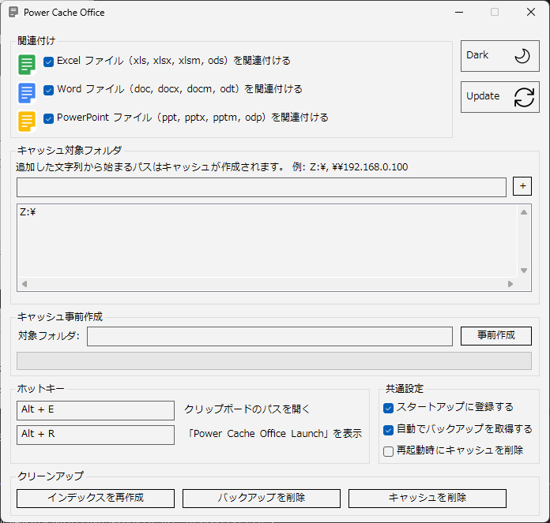
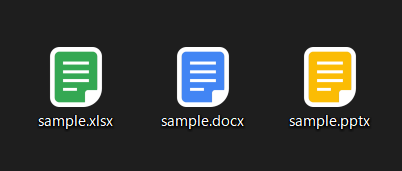

# Power Cache Office
共有フォルダのOfficeファイルが、重くてなかなか開けなかった経験はありませんか？  
やっとの思いで開いたファイルが、使用中で更新できなかったことは？  
検索に時間がかかり、探しているファイルが見つからなかったことは？  
  
「Power Cache Office」はこれらの問題を解決します。
* リモートのOfficeファイルを開くと、自動でローカルにコピーを作成します。
    * ローカルPCにあるファイルとして、軽快に操作することができます。
        * 検索も高速に実行できます。
    * リモートのファイルをロックしないため、他の人との共同作業を邪魔しません。
* ローカルのコピーを更新すると、自動でリモートへアップロードします。
    * リモートのタイムスタンプが変わっていた場合、開いて内容を確認してからアップロードすることもできます。

## 画面構成
以下が「Power Cache Office」の画面構成です。  
各機能の使い方を説明していきます。  
  

### 関連付け
チェックを入れた拡張子が「Power Cache Office」で開くように関連付けを行います。  
特に理由がなければ、すべてチェックを入れてください。  
  
Officeファイルを開くアプリが「Power Cache Office」のアイコンになっていれば完了です。  
うまくいかない場合は、PCを一度再起動してみてください。  
  

### キャッシュ対象フォルダ
キャッシュ作成する（ローカルPCにコピーを作成する）フォルダを指定します。  
共有フォルダや、外付けハードディスクのパスを指定してください。  
  
テキストボックスにパスを入力し「＋」ボタンを押すと追加されます。  
追加したパスを削除する場合、選択して「Delete」キーを押してください。

### インデックスを再作成
ローカルのコピーとリモートの関係を再作成します。  
リモートのOfficeファイルが、うまく開けなくなった場合に実施してください。

### キャッシュを削除
ローカルのコピーをすべて削除します。  
インデックスを再作成しても、リモートのOfficeファイルがうまく開けない場合や、PCの容量が不足した場合に実施してください。

### キャッシュフォルダを検索
キーワードを入力してボタンを押すと、ローカルのコピーを対象に検索を実施します。  

### キャッシュを事前作成
対象フォルダを入力してボタンを押すと、フォルダにあるOfficeファイルをローカルにコピーします。  
以下の2点に注意して実施してください。
* 処理に時間がかかる可能性があります。
* 大量のファイルをキャッシュすると、PCの容量が不足する可能性があります。

## インストール
インストーラーはありません。  
[アプリ本体](https://github.com/p1tchbend-tool/PowerCacheOffice/tree/master/App)を適当な場所に配置して実行します。

## セットアップ
アプリを実行するとタスクトレイに常駐します。  
タスクトレイのアイコンをクリックして画面を開き、各種設定を実施してください。  
設定後は最小化すると、タスクトレイに常駐して動作し続けます。

## アンインストール
1. 「関連付け」のチェックをすべて外します。
1. アプリを終了します。
1. アプリをフォルダごと削除します。

## ライセンス
本アプリは、[MIT ライセンス](https://licenses.opensource.jp/MIT/MIT.html)で提供されます。

## 連絡先
本アプリに関するご連絡は、[こちら](<mailto:p1tchbend.tool@gmail.com>)までお願いいたします。
